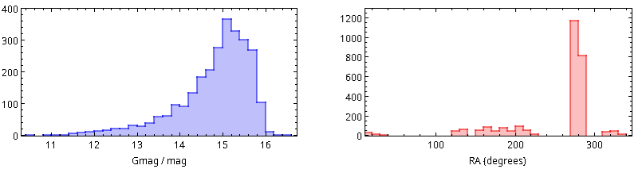
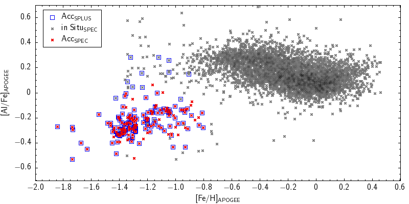

# StreamInG@4MOST: Stellar Streams in the Inner Galaxy with S-PLUS and 4MOST

## Abstract: 
We propose 4MOST/HRS observations of 2670 stars identified as candidate members of 9 stellar streams in the inner Milky Way, selected from S-PLUS photometry and Gaia DR3 astrometry. The main goals are to: (1) obtain radial velocities to constrain orbits; (2) derive multi-element abundances to identify progenitors and disentangle overlaps; and (3) search for chemical gradients and multiple populations in globular cluster streams. This project will connect halo substructure studies with the chemo-dynamical mapping of the disk and bulge, offering new insights into the Galaxy’s assembly history.

## PI and CoIs
  - PI: Fábio R. Herpich (LNA - Brazil)
  - CoI: Claudia Mendes de Oliveira (IAG/USP Brazil)
  - CoI: Cristina Chiappini (AIP Potsdam - Germany)

## Resolution
( ) Low Resolution  (X) High Resolution

## Target type
(X) Galactic  ( ) Extragalactic

## Which Surveys is this proposal related to?
  - S1  - Milky Way Halo Low Resolution Survey
  - S2  - Milky Way Halo High Resolution Survey
  - S3  - Milky Way Bulge and Disk Low Resolution Survey
  - S4  - Milky Way Bulge and Disk Low Resolution Survey
  - S14 - The 4MOST Survey of Dwarf Galaxies and their Stellar Streams

## Which other supplementary target proposals is this proposal related to?
None

## Dataset Description

This dataset contains astronomical targets selected for observation with the 4MOST spectrograph (4-metre Multi-Object Spectroscopic Telescope). The file [4MOST_StreamInG_targets_HRS.fits](4MOST_StreamInG_targets_HRS.fits) includes a compilation of 2670 candidate members of stellar streams, selected using S-PLUS and Gaia, with their celestial coordinates, magnitudes, and other properties relevant for spectroscopic observations.

## FITS File Structure

The main file [4MOST_StreamInG_targets_HRS.fits](4MOST_StreamInG_targets_HRS.fits) contains a binary table with multiple columns describing the properties of the target objects. The data is formatted according to 4MOST requirements for observation proposals.

## Column Descriptions

| Index | Name | Description | Type |
|-------|------|-------------|------|
| 0 | INDEX | Row index in the table | Long |
| 1 | NAME | Object identifier | String |
| 2 | RA | Right ascension (J2027) in degrees | Double |
| 3 | DEC | Declination (J2027) in degrees | Double |
| 4 | PMRA | Proper motion in RA (mas/year) | Double |
| 5 | PMDEC | Proper motion in DEC (mas/year) | Double |
| 6 | EPOCH | Position epoch | Double |
| 7 | RESOLUTION | Required spectral resolution | Long |
| 8 | SUBSURVEY | Subsurvey identifier | String |
| 9 | TEMPLATE | Spectral template to be used | String |
| 10 | RULESET | Observation ruleset | String |
| 11 | EXTENT_FLAG | Object extent flag | Long |
| 12 | EXTENT_PARAMETER | Extent parameter | Double |
| 13 | EXTENT_INDEX | Extent index | Double |
| 14 | MAG_TYPE | Photometric magnitude system | String |
| 15 | MAG | Object magnitude | Double |
| 16 | MAG_ERR | Magnitude error | Double |
| 17 | DATE_EARLIEST | Earliest observation date | Long |
| 18 | DATE_LATEST | Latest observation date | Long |
| 19 | CADENCE | Observation cadence | Long |
| 20 | REDDENING | Reddening (E(B-V)) | Double |
| 21 | REDSHIFT_ESTIMATE | Estimated redshift | Double |
| 22 | REDSHIFT_ERROR | Estimated redshift error | Double |
| 23 | TEMPLATE_REDSHIFT | Template redshift | Double |
| 24-32 | CAL_MAG_* | Calibrated magnitudes in different bands | Double |
| 33 | CLASSIFICATION | Object classification | String |
| 34 | COMPLETENESS | Observation completeness | Double |
| 35 | PARALLAX | Object parallax | Double |

## Scientific Context

This catalog was compiled as part of a project studying stellar streams accreted from dwarf satellites of the Milky Way. These objects are targets for the 4MOST telescope, a high-resolution multi-object spectrograph installed.

4MOST will conduct several spectroscopic surveys, and this catalog was prepared as part of a proposal for supplementary observation time. All targets comply with the specific requirements of 4MOST for scientific proposals, including the standard target catalog format.

## Target Selection Criteria

The StreamInG@4MOST targes were selected following the process summarized below

  - Initial selection from S-PLUS iDR6 with S/N $>3$ in at least one broad band and complete photometry in all 12 filters and with 12 < g < 16 mag.
  - Cross-match with Gaia DR3 to obtain astrometry and kinematics. Also used the gaia catalog to correct for dust extinction.
  - Application of our photometric classification method (Bolutavicius et al., in prep.) to identify stars likely accreted or unevolved.
  - Identification of candidate stream members with galstreams, requiring chi² consistency at the 8 sigma level.
  - Final restriction to streams with > 20 members.

That left us with 2670 stars, distributed in the parent streams 20.0-1-M18, Corvus-M18, Gaia-3-M18, M30-S20, NGC 5053-L06, NGC 6362-S20, Palca-S18, Parallel-W18 and Yangtze-Y23.

### Figures

